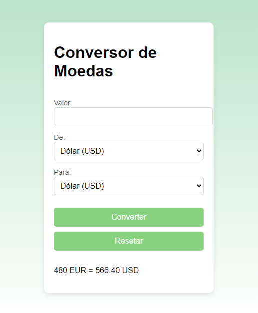

# Conversor de Moedas
## Índice
1. [Descrição](#descrição)
2. [Introdução](#introdução)
3. [Funcionalidades](#funcionalidades)
4. [Interface](#interface)
5. [Tecnologias Utilizadas](#tecnologias-utilizadas)
6. [Referências](#referências)
7. [Funções do JavaScript](#funções-do-javascript)

## Descrição
Esse projeto é um conversor de moedas que permite ao usuário inserir um valor em uma moeda e convertê-lo para outra moeda selecionada. O sistema utiliza uma API para obter a taxa de câmbio atual e calcular o valor convertido com precisão.

## Introdução
O Conversor de Moedas foi criado para facilitar a conversão entre diferentes moedas, tornando o processo simples e rápido. Este projeto é ideal para pessoas que precisam fazer conversões de moedas em viagens ou transações internacionais.

## Funcionalidades
- **Conversão em tempo real:** O sistema busca a taxa de câmbio atual na API e realiza a conversão automaticamente ao clicar no botão.
- **Seleção de moedas:** Permite ao usuário escolher entre diversas moedas para conversão.
- **Limpeza de campos:** Um botão para limpar os campos e reiniciar o processo de conversão.
- **Alertas:** Informa se houver algum problema ao buscar os dados da API.

## Interface

A interface é simples e amigável, projetada para ser responsiva e intuitiva. Os campos de entrada e os botões estão organizados de forma a facilitar a interação do usuário.

## Tecnologias Utilizadas
- **HTML:** Estruturação da interface do conversor.
- **CSS:** Estilização visual do projeto, incluindo layouts e cores agradáveis.
- **JavaScript:** Implementação da lógica do conversor, incluindo chamadas à API e manipulação de dados.

## Referências
- [API de Câmbio](https://exchangeratesapi.io/) - API utilizada para obter as taxas de câmbio entre as moedas.

## Funções do JavaScript
### 1. `converterMoeda()`
Essa função realiza a conversão entre as moedas selecionadas. Ela obtém as taxas de câmbio da API e calcula o valor convertido com base no valor inserido pelo usuário.
### 2. `limparCampos()`
Essa função limpa todos os campos de entrada e redefine os valores para que o usuário possa inserir novos dados sem interferência.
### 3. `atualizarMoedas()`
Essa função atualiza as opções disponíveis para seleção de moedas na interface. Ela busca as moedas suportadas na API e as adiciona aos elementos de seleção.
### 4. `exibirResultado(valorConvertido)`
Essa função exibe o resultado da conversão na interface. Ela recebe o valor convertido como parâmetro e o apresenta ao usuário de forma clara.
### 5. `fetch(url)`
A função `fetch` é utilizada para fazer uma requisição HTTP para a URL da API, retornando uma `Promise` que resolve com a resposta da requisição. Essa abordagem moderna facilita a comunicação com APIs externas.
### 6. `await`
O `await` é utilizado em funções assíncronas para esperar que uma `Promise` seja resolvida. Com isso, as operações assíncronas são tratadas de maneira mais sequencial e fácil de entender, especialmente ao lidar com chamadas à API.