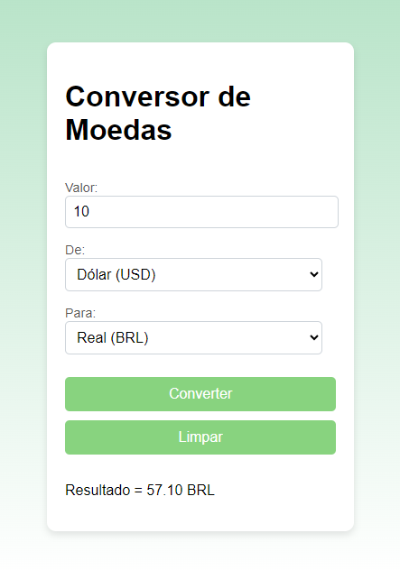

# Conversor de Moedas Simples
## Índice
1. [Descrição](#descrição)
2. [Introdução](#introdução)
3. [Funcionalidades](#funcionalidades)
4. [Interface](#interface)
5. [Tecnologias Utilizadas](#tecnologias-utilizadas)
6. [Funções do JavaScript](#funções-do-javascript)

## Descrição
Esse projeto é um conversor de moedas que permite ao usuário inserir um valor em uma moeda e convertê-lo para outra moeda selecionada. O sistema utiliza taxas de câmbio fixas no código para calcular o valor convertido.

## Introdução
O Conversor de Moedas foi criado para facilitar a conversão entre diferentes moedas, tornando o processo simples e rápido. Este projeto é ideal para aprendizado de desenvolvimento web com HTML, CSS e JavaScript, especialmente para praticar a manipulação de formulários e cálculos no frontend.

## Funcionalidades
- **Conversão baseada em taxas fixas:** O sistema utiliza taxas de câmbio definidas diretamente no código, realizando a conversão ao clicar no botão.
- **Seleção de moedas:** Permite ao usuário escolher entre Dólar, Euro e Real para a conversão.
- **Limpeza de campos:** Um botão para limpar os campos e reiniciar o processo de conversão.

## Interface

A interface é simples e amigável, projetada para ser responsiva e intuitiva. Os campos de entrada e os botões estão organizados de forma a facilitar a interação do usuário.

## Tecnologias Utilizadas
- **HTML:** Estruturação da interface do conversor.
- **CSS:** Estilização visual do projeto, incluindo layout e cores.
- **JavaScript:** Implementação da lógica do conversor, incluindo cálculos e manipulação do DOM.

## Funções do JavaScript
### 1. `converterMoeda(event)`
Essa função é chamada ao submeter o formulário de conversão. A função faz o seguinte:
- **Evita o comportamento padrão do formulário** usando `event.preventDefault()` para impedir o recarregamento da página.
- **Obtém o valor inserido** no campo de entrada `amount`, substituindo a vírgula por ponto e convertendo-o para um número decimal.
- **Valida o valor numérico:** verifica se o valor é válido (não `NaN`); caso contrário, exibe um alerta ao usuário.
- **Seleciona as moedas de origem e destino** com base nos campos `fromCurrency` e `toCurrency`.
- **Define as taxas de câmbio fixas** em um objeto chamado `exchangeRates`.
- **Realiza a conversão:** se a moeda de origem for igual à moeda de destino, o valor permanece o mesmo; caso contrário, o valor é multiplicado pela taxa de câmbio apropriada.
- **Exibe o resultado** chamando `atualizarResultado(valorConvertido)` para mostrar o valor convertido na interface.
### 2. `atualizarResultado(valorConvertido)`
Essa função exibe o resultado da conversão na interface. Ela:
- Seleciona o elemento `
` com `id="conversao"`.
- Atualiza o texto do elemento para mostrar o valor convertido, formatando o resultado com duas casas decimais e anexando a moeda de destino.
### 3. `limparCampos()`
Essa função é acionada pelo botão de reset para limpar os campos de entrada e redefinir o valor da conversão. Ela:
- Reseta os campos de entrada (`amount`, `fromCurrency`, `toCurrency`) para que o usuário possa iniciar uma nova conversão.
- Limpa o conteúdo do elemento `conversao`, apagando o resultado da última conversão.
### 4. `eventListener`
No final do script, um ouvinte de eventos (`eventListener`) é adicionado ao formulário `currency-form`. Ele:
- Escuta o evento `submit` e chama a função `converterMoeda()` sempre que o formulário é enviado.
Essas funções trabalham juntas para garantir que o sistema funcione de maneira coesa, proporcionando uma experiência de conversão simplificada e intuitiva para o usuário.